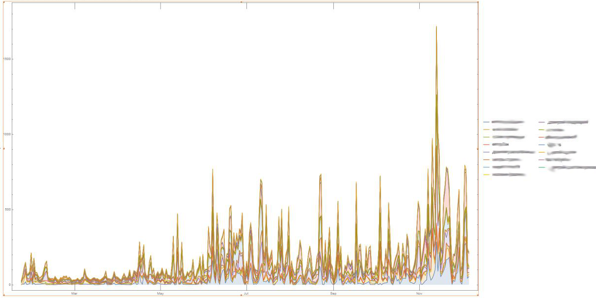
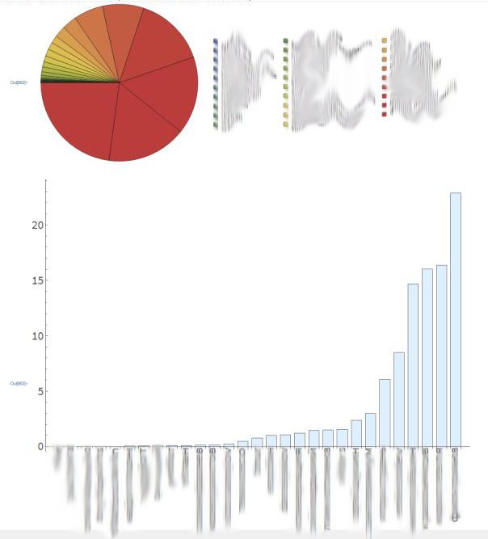

# Telegram Chat History Parser

Does what the name says. 

## Usage

In desktop Telegram select `Export chat history` option. 
Then do:
```
node . --historyDir /path/to/history --outFile parsed.json
```

Optionally provide `--cleanupNames` argument to get rid of dates and other unwanted stuff in users' nicknames.


## Example of what you can do with parsed data
### _Messages distribution over time_  


### _User top by overall message percentage_  


